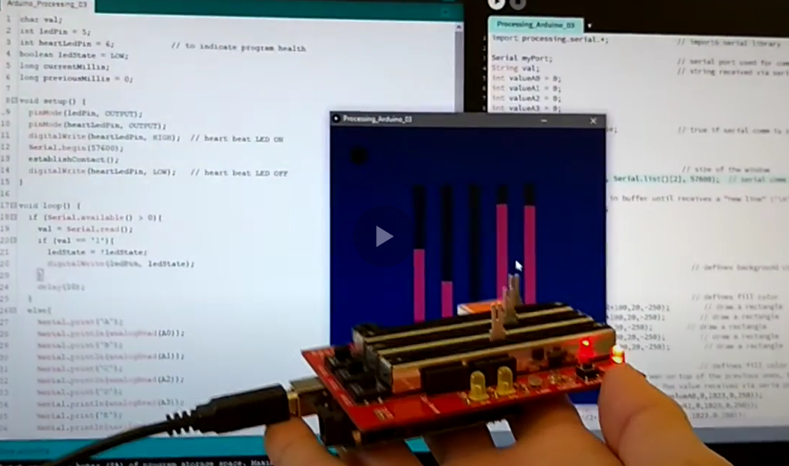

# Arduino-Processing Serial Communication
Here you will find simple example code to implement serial communication and understand how to exchange information between an Arduino board and the computer (running a Processing sketch). The primary goal of the examples here presented is **educational**: to help understanding how to exchange information between systems through ASCII characters via serial connection.

The examples assume that the Arduino board has a few sensors connected to the analogue inputs, an LED in a digital output, and a button. A screenshot of the Processing sketch "Processing_Arduino_03.pde" is shown below. The bars represent the values of different sensors received from the Arduino. When the yellow circle is clicked, an LED in the Arduino changes state. 

# How to use the examples

You will need an Arduino board, a computer with Processing 2 or 3 installed, and a USB cable.

To use the examples you need to upload the `.ino` code to the Arduino and run the corresponding `.pde` code to Processing. For example, if you load the code `Arduino_Processing_01.ino` to the Arduino, you need to run the code `Processing_Arduino_01.pde` in Processing. There are three pairs of code with increasing complexity (from the simplest _01 to the more complex _03).

Make sure the Arduino is connected to the computer via a USB cable. Open Processing and run the corresponding code. 

# Fundamentals
Data is sent between Arduino and Processing via serial port. It is important that the configuration of the serial port in the Arduino matches the configuration in Processing (both need to use the same COM port at the same baud rate). 

In the Arduino, characters are sent to the serial port via the function `Serial.print()` or `Serial.println()`. You can read characters using the command `Serial.read()`. 

In Processing, the callback function `serialEvent(Serial myPort)` will be called when a character is received via serial port. The function `myPort.write()` can be used to send a character to the serial port. 

## The examples
In this first example, the Arduino continuously send to Processing the value returned from reading the analogue value of port A0. At the same time, it will change the state of the pin `ledPin` if the character '1' is received from Processing.
Processing will print to the console the values received from the Arduino. If you click anywhere in the program screen, Processing will send the character '1' to the Arduino. 

The second and third examples follow the same principle, but with increase complexity in the communication. It is a good exercise to try to understand the code yourself. You can watch [this video](https://youtu.be/IawITwewga8) for a short explanation.

## Test
The code was tested with Arduino Uno R3 (programmed with the Arduino IDE 1.6.8 and 1.8.1) and Processing 2.2.1 and 3.3, running in Windows 10. 

# License
This project is licensed under the terms of the [MIT license](https://github.com/felipenmartins/Arduino-Processing-Serial-Communication/blob/master/LICENSE).
